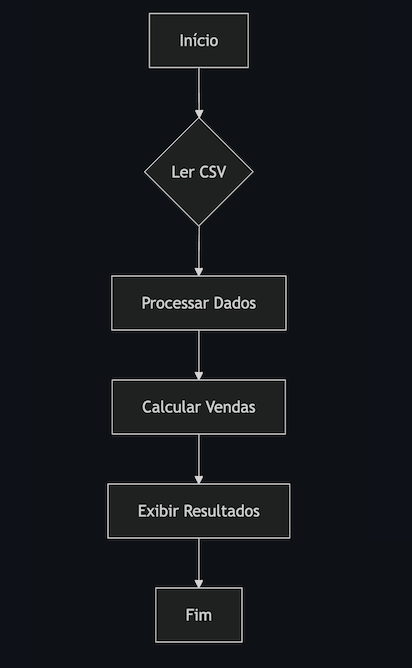

<h4> Pipeline-ETL </h4>

Análise de Vendas de Produtos 

Objetivo: Dado um arquivo CSV contendo dados de vendas de produtos, o desafio consiste em ler os dados, processá-los em um dicionário para análise e, por fim, calcular e reportar as vendas totais por categoria de produto.

 <h3>Fluxograma<h3> 

 

<h4> Tarefas: </h4>

<li>Ler o arquivo CSV e carregar os dados. </li>
<li>Processar os dados em um dicionário, onde a chave é a categoria, e o valor é uma lista de dicionários, cada um contendo informações do produto (Produto, Quantidade, Venda).</li>
<li>Calcular o total de vendas (Quantidade * Venda) por categoria.</li>

<h4>Funções</h4>

<h5>Ler CSV:</h5>
<li>Função: ler_csv </li>
<li>Entrada: Nome do arquivo CSV </li>
<li>Saída: Lista de diconários com dados lidos </li>
    
<h5>Processar Dados:</h5>

<li>Função: processar_dados</li>
<li>Entrada: Lista de dicionários<li>
Saída: Dicionário processado conforme descrito </li>

<h5>Calcular Vendas por Categoria:</h5>

<li>Função: calcular_vendas_categoria</li>
<li>Entrada: Dicionário processado</li>
<li>Saída: Dicionário com total de vendas por categoria </li>